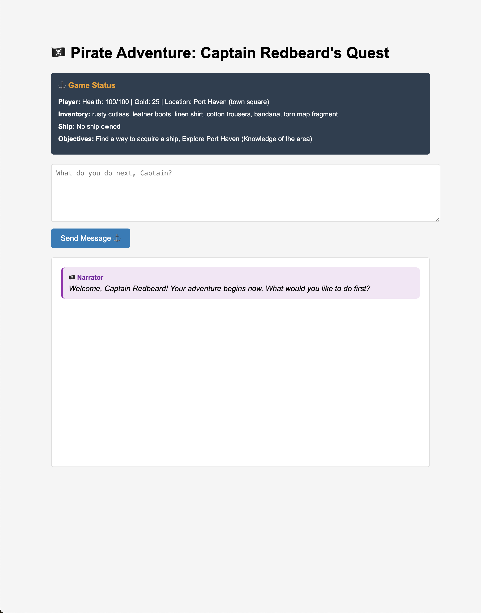
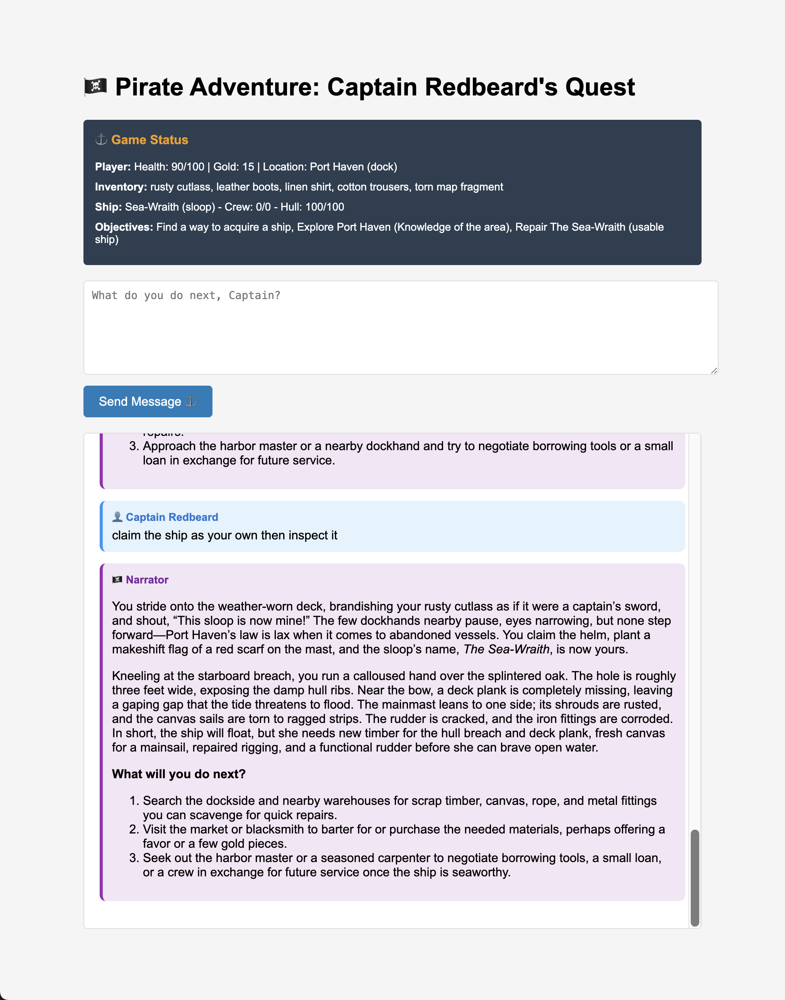

# 🏴‍☠️ Pirate Adventure Game

An interactive text-based pirate adventure game powered by LangChain and Ollama AI.

## Features
- **AI-Driven Storytelling**: Dynamic narrative with intelligent responses
- **LangGraph Workflow**: Advanced agent workflow with tool execution
- **Dynamic Content Management**: AI can create new items and enemies on-demand
- **Intelligent Tool Selection**: Smart fallback strategies and fuzzy matching
- **Real-time Game State**: Persistent player stats, inventory, and objectives

## Installation
```bash
npm install
npm start
```
Visit `http://localhost:3001`

## API Endpoints

| Method | Endpoint | Description | Request Body |
|--------|----------|-------------|--------------|
| POST | `/api/chat` | Process player actions with AI agent | `{ messages: Array, model: String }` |

## AI Tool Functions

### Item Management
- `get_item_info`: Get item details with fuzzy matching
- `getShopItems`: List items by type with intelligent category handling
- `getRandomItems`: Generate random item selections
- `addItemToItemsList`: Create new items dynamically
- `listItemTypes`: Show available item types
- `listItemCategories`: Display all item categories and structure

### Enemy Management  
- `get_enemies_info`: Get enemy details with smart matching
- `getRandomEnemy`: Select random enemies from categories
- `createEnemy`: Generate new enemies on-demand
- `listAllEnemies`: Show all enemy categories
- `listEnemyCategories`: Display enemy category structure

### Intelligence Features
- **Fuzzy Category Matching**: Handles "weapon" vs "weapons" automatically
- **Smart Fallbacks**: Suggests alternatives when exact matches fail
- **Dynamic Content Creation**: AI creates missing items/enemies as needed

## UI before adventure



## UI after losing health, gold, bandana, and claiming a ship 



